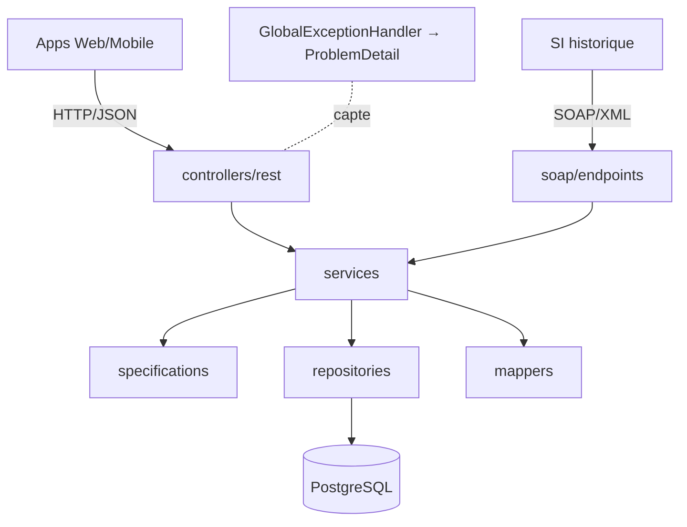
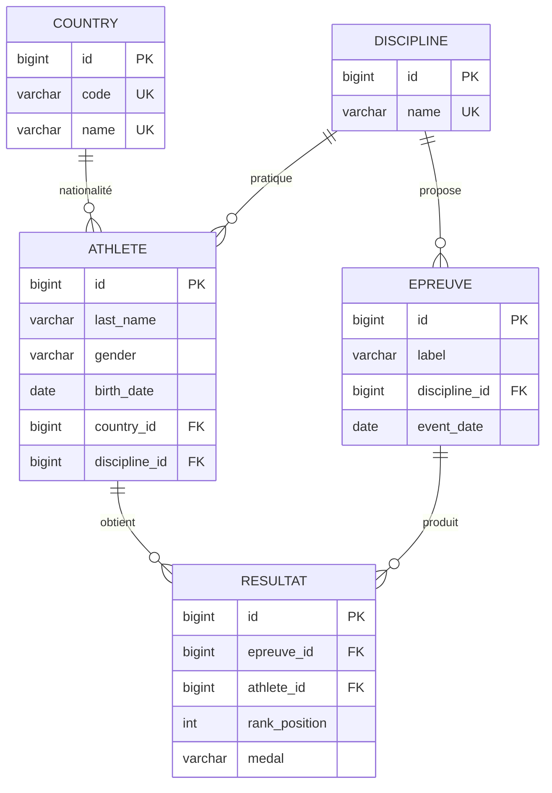
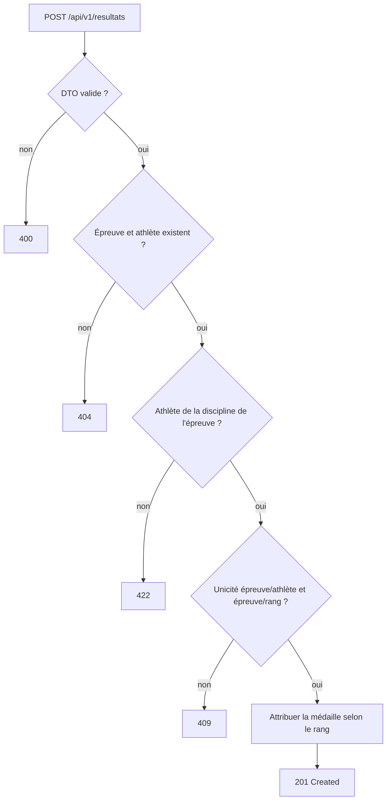

# Plateforme JO — API REST & Web Service SOAP

<!-- Remplacez OWNER/REPO par le chemin de votre dépôt GitHub. -->
[](https://github.com/OWNER/REPO/actions/workflows/ci.yml)
[](https://github.com/OWNER/REPO/actions/workflows/codeql.yml)

Plateforme numérique centralisée des Jeux Olympiques : gestion des disciplines, athlètes, épreuves
et résultats, calcul automatique du tableau des médailles et statistiques. Elle expose
**simultanément** une **API REST** (applications Web/Mobile) et un **Web Service SOAP en lecture
seule** (système d'information historique), au-dessus d'un **socle de services unique**.

> Projet Java 21 / Spring Boot 3 conçu comme référence pédagogique et base de mise en production.

## Sommaire

- [Fonctionnalités](#fonctionnalités)
- [Architecture](#architecture)
- [Modèle de données](#modèle-de-données)
- [Flux métier — enregistrement d'un résultat](#flux-métier--enregistrement-dun-résultat)
- [Interface web (Thymeleaf)](#interface-web-thymeleaf)
- [Technologies](#technologies)
- [Prérequis](#prérequis)
- [Lancement](#lancement)
- [Configuration & profils](#configuration--profils)
- [Base de données, Flyway & jeu de démo](#base-de-données-flyway--jeu-de-démo)
- [API REST & Swagger](#api-rest--swagger)
- [Web Service SOAP](#web-service-soap)
- [Administration (sécurisé)](#administration-sécurisé)
- [Supervision](#supervision)
- [Tests](#tests)
- [Intégration continue (CI/CD)](#intégration-continue-cicd)
- [Commandes Maven](#commandes-maven)
- [Organisation des packages](#organisation-des-packages)
- [Collection Postman](#collection-postman)
- [Documentation de conception](#documentation-de-conception)

## Fonctionnalités

| Domaine | Points d'entrée | Faits marquants |
|---|---|---|
| **Disciplines** | CRUD + `GET /disciplines/{id}/athletes` | Nom unique (insensible à la casse) |
| **Nations** | Création + consultation | Référentiel (code ISO), jeu de référence Flyway |
| **Athlètes** | CRUD (PUT + PATCH) + recherche multicritère | Specifications, pagination, tri |
| **Épreuves** | CRUD + recherche par discipline / par date | Unicité (libellé, discipline, date) |
| **Résultats** | CRUD + `GET /epreuves/{id}/podium` | Médaille auto (rang→médaille), cohérences 409/422 |
| **Tableau des médailles** | `GET /tableau-medailles` | Classement or→argent→bronze (départage A→Z) |
| **Tableau de bord** | `GET /tableau-de-bord` (+ `/classement-points`) | Compteurs + points (Or=7, Argent=4, Bronze=1) |
| **SOAP** | `GetAthlete`, `GetMedalTable` | Lecture seule (SI historique), contrat XSD/WSDL |
| **Administration** | `/api/admin/**` + console `/backoffice` | JWT, import async CSV/XLSX, export/sauvegarde/réinitialisation, journal |

## Architecture

Architecture en couches ; REST et SOAP sont deux **façades minces** au-dessus des mêmes services.



Détails et responsabilités par package : [`docs/architecture.md`](docs/architecture.md).

## Modèle de données



La médaille est **dérivée du rang** (1→OR, 2→ARGENT, 3→BRONZE) et verrouillée en base par un
`CHECK`. Détails, contraintes et stratégie Flyway : [`docs/data-model.md`](docs/data-model.md).

## Flux métier — enregistrement d'un résultat



## Technologies

Java 21 · Spring Boot 3.3 · Maven · PostgreSQL 16 · Spring Data JPA · Spring Validation ·
Spring Web · Spring WS (SOAP) · Thymeleaf · SpringDoc OpenAPI/Swagger · Lombok · Flyway · Actuator ·
Docker / Docker Compose · JUnit 5 · Mockito · Testcontainers · JAXB.

**Interdits** : MapStruct, Gradle.

## Prérequis

- **JDK 21** (build/run local). Via SDKMAN : `sdk install java 21-tem`
- **Maven 3.9+**
- **Docker** et **Docker Compose**

## Lancement

### Option A — Docker Compose (recommandé)

Démarre PostgreSQL **et** l'application (profil `prod`) :

```bash
docker compose up --build
```

- API : http://localhost:8080
- Swagger UI : http://localhost:8080/swagger-ui.html
- WSDL : http://localhost:8080/ws/olympics.wsdl
- Santé : http://localhost:8080/actuator/health

### Option B — Local (profil `dev`, avec jeu de démonstration)

```bash
docker compose up -d db      # PostgreSQL seul
mvn spring-boot:run          # application (profil dev par défaut)
```

Le profil `dev` charge un **jeu de démonstration** (disciplines, épreuves, athlètes, résultats),
de quoi obtenir immédiatement un tableau des médailles peuplé.

## Configuration & profils

| Profil | Datasource | Flyway | Usage |
|---|---|---|---|
| `dev` (défaut) | PostgreSQL local | `db/migration` + `db/seed` | Développement (données de démo) |
| `test` | Testcontainers | `db/migration` | Tests d'intégration |
| `prod` | Variables d'environnement | `db/migration` | Production / Docker |

Les variables d'environnement sont documentées dans [`.env.example`](.env.example) (à copier en
`.env` local, **non versionné**). En profil `dev`, `spring-dotenv` charge automatiquement `.env` au
démarrage ; en `prod`, ces variables proviennent de l'environnement (ou de `docker-compose`).

| Variable | Rôle | Défaut |
|---|---|---|
| `SPRING_DATASOURCE_URL` / `_USERNAME` / `_PASSWORD` | Connexion PostgreSQL (prod) | — |
| `JWT_SECRET` | Clé HMAC des jetons (≥ 64 caractères) | clé de dev |
| `JWT_ISSUER` · `JWT_ACCESS_TTL` · `JWT_REFRESH_TTL` | Émetteur et durées de vie des jetons | `jodak` · `PT15M` · `P7D` |
| `ADMIN_EMAIL` · `ADMIN_PASSWORD` | Compte administrateur créé au démarrage **s'il n'en existe aucun** | — |
| `IMPORT_MAX_FILE_SIZE_BYTES` · `IMPORT_MAX_UNCOMPRESSED_BYTES` · `IMPORT_MIN_INFLATE_RATIO` | Durcissement des fichiers importés | 25 Mio · 200 Mio · 0.01 |
| `BACKUP_STORAGE_DIR` | Répertoire des sauvegardes | `${tmp}/jodak-backups` |
| `ADMIN_RESET_ENABLED` · `ADMIN_RESET_CONFIRMATION_PHRASE` | Réinitialisation (désactivée par défaut, double confirmation) | `false` · `REINITIALISER-DAKAR-2026` |

> **Amorçage du back-office (dev)** : renseignez `ADMIN_EMAIL` et `ADMIN_PASSWORD` dans un fichier
> `.env`, lancez `mvn spring-boot:run`, puis connectez-vous sur
> [`/backoffice/login`](http://localhost:8080/backoffice/login). L'admin n'est (re)créé que si la
> table est vide — `docker compose down -v` remet la base à zéro.

## Base de données, Flyway & jeu de démo

- Migrations **Flyway en SQL brut** (`src/main/resources/db/migration`) : `V1` disciplines →
  `V5` résultats, puis `V6`–`V9` pour l'administration (`admin_user`, `refresh_token`, `admin_log`,
  `import_job`). Contraintes portées par la base (PK, FK, UNIQUE, CHECK, INDEX).
- `hibernate.ddl-auto=validate` : Hibernate **valide** le schéma, ne le modifie jamais.
- **Jeu de démo** (`db/seed`, profil `dev` uniquement) : **callback Flyway `afterMigrate`**
  idempotent, réalignant les séquences d'identité après insertion. Étant un callback, il n'est
  **pas** enregistré dans l'historique Flyway — aucune contamination entre profils (le profil
  `prod` n'inclut pas `db/seed`).

## Interface web (Thymeleaf)

Un site server-side (Thymeleaf) présente les données de façon moderne et responsive
(mobile → desktop), en **réutilisant les mêmes services** que l'API (aucune logique dupliquée) :

| Page | URL | Contenu |
|---|---|---|
| Accueil | `/` | Page d'accueil **Dakar 2026** : présentation du JOJ, compte à rebours, faits clés, mascotte |
| Tableau de bord | `/dashboard` | Nation en tête, statistiques, médailles, classement par points |
| Disciplines | `/disciplines` | Grille des disciplines (→ athlètes) |
| Athlètes | `/athletes` | Recherche multicritère (nom, sexe, discipline), pagination |
| Épreuves | `/epreuves` | Filtre par discipline, dates |
| Médailles | `/medailles` | Tableau des médailles + classement par points |

Thème sombre « encre » avec accent or, typographies distinctives (Bricolage Grotesque / IBM Plex),
menu adaptatif, tables défilables sur mobile, micro-animations au chargement.

## API REST & Swagger

- Préfixe : `/api/v1/`
- Erreurs uniformisées via **`ProblemDetail`** (RFC 7807), messages en français.
- Réponses de liste paginées homogènes (`content`, `page`, `size`, `totalElements`, …).
- Documentation interactive : **Swagger UI** (`/swagger-ui.html`).

## Web Service SOAP

Service **lecture seule** pour le SI historique (Spring WS), contrat **XSD** →
classes JAXB générées au build.

- Endpoint : `POST /ws` — WSDL : `GET /ws/olympics.wsdl`
- Opérations : `GetAthleteRequest` (consultation d'un athlète), `GetMedalTableRequest`
  (tableau des médailles).

Exemple d'enveloppe :

```xml
<soapenv:Envelope xmlns:soapenv="http://schemas.xmlsoap.org/soap/envelope/"
                  xmlns:ol="http://jodak.com/olympics/soap">
  <soapenv:Body>
    <ol:GetAthleteRequest><ol:id>1</ol:id></ol:GetAthleteRequest>
  </soapenv:Body>
</soapenv:Envelope>
```

## Administration (sécurisé)

Module d'administration protégé par **Spring Security 6 + JWT**, exposé en deux temps : une **API
REST** `/api/admin/**` et une **console web** Thymeleaf isolée `/backoffice` (non référencée depuis
le site public). Spécification complète : [`docs/admin.md`](docs/admin.md).

**Modèle de sécurité (Option A)** — la lecture reste publique, les écritures et l'administration
sont protégées :

| Portée | Règle |
|---|---|
| `GET /api/v1/**`, vues web, Swagger, SOAP, `/actuator/health` | Public |
| `POST/PUT/PATCH/DELETE /api/v1/**` et `/api/admin/**` | `ROLE_ADMIN` ou `ROLE_SUPER_ADMIN` (JWT) |

Authentification **stateless** : `POST /api/admin/auth/login` renvoie un *access token* (courte
durée) et un *refresh token* (rotation à chaque `refresh`) ; verrouillage du compte après 5 échecs.
Le jeton se transmet via l'en-tête `Authorization: Bearer <token>`.

| Domaine | Endpoints | Détails |
|---|---|---|
| **Authentification** | `POST /api/admin/auth/{login,refresh,logout}` | JWT, rotation, verrouillage |
| **Import asynchrone** | `POST /api/admin/imports` · `GET .../{id}` · `.../{id}/errors` · `.../{id}/cancel` · `.../{id}/rollback` | **CSV & XLSX**, DRY_RUN/COMMIT, progression, annulation, compensation, rapport d'erreurs |
| **Export** | `GET /api/admin/export` | Archive ZIP (CSV par domaine + `metadata.json`, empreintes SHA-256) |
| **Sauvegarde** | `POST /api/admin/backup` · `GET .../{fileName}/download` | Sauvegarde logique côté serveur |
| **Réinitialisation** | `POST /api/admin/reset` | Destructif, **désactivé par défaut**, double confirmation (mot de passe + phrase), sauvegarde préalable |
| **Journal** | `GET /api/admin/logs` | Audit des actions d'administration |

**Durcissement des imports** : taille bornée, cohérence extension ↔ format, et pour les `.xlsx`
(archives ZIP lues par Apache POI) protections **anti « zip bomb »** (ratio et taille de
décompression bornés), **XXE** (entités externes XML désactivées) et **zip slip** (aucune extraction
disque) — voir `PoiSecurityConfig` et `ImportFileValidator`. Fichiers d'exemple : `sample-imports/`.

## Supervision

Spring Boot Actuator expose la santé : `GET /actuator/health` (utilisée par le healthcheck Docker).

- **Unitaires** (JUnit 5 + Mockito) — rapides, sans Docker : `mvn test`
- **Intégration** (`*IT`, Testcontainers PostgreSQL) — nécessitent Docker : `mvn verify`

`mvn verify` fonctionne avec **Java 21 et un démon Docker démarré**, sans réglage manuel : la
version d'API Docker (compatibilité Docker Engine ≥ 29) et la désactivation de Ryuk sont déjà
configurées dans le projet (`maven-failsafe-plugin` et `src/test/resources/testcontainers.properties`).

Si Testcontainers ne trouve pas le démon Docker (ex. socket Docker Desktop non standard), indiquez-le :

```bash
export DOCKER_HOST="unix://$HOME/Library/Containers/com.docker.docker/Data/docker.raw.sock"
mvn verify
```

## Intégration continue (CI/CD)

Trois workflows GitHub Actions (dossier [`.github`](.github)) :

| Workflow | Fichier | Déclencheurs | Rôle |
|---|---|---|---|
| **CI** | [`ci.yml`](.github/workflows/ci.yml) | push `main`/tags `v*`, PR vers `main`, manuel | `mvn clean verify` (JDK 21 Temurin, cache Maven, tests **Testcontainers**), publie les rapports de tests et le jar ; puis, hors PR, **construit et publie l'image Docker sur GHCR** |
| **CodeQL** | [`codeql.yml`](.github/workflows/codeql.yml) | push/PR `main`, hebdomadaire | Analyse statique de sécurité (SAST) du code Java |
| **Dependabot** | [`dependabot.yml`](.github/dependabot.yml) | hebdomadaire | Propose par PR les mises à jour Maven et des actions GitHub |

**Détails**
- Le runner `ubuntu-latest` fournit un démon Docker : les tests d'intégration Testcontainers
  s'exécutent sans réglage (Ryuk désactivé via `src/test/resources/testcontainers.properties`).
- L'image est publiée sur **GitHub Container Registry** : `ghcr.io/<owner>/olympics-platform`,
  taguée par branche, version sémantique (`v1.2.3`), SHA court, et `latest` sur `main`. La
  publication utilise le `GITHUB_TOKEN` (permission `packages: write`) — aucun secret à configurer.
- Récupérer l'image : `docker pull ghcr.io/<owner>/olympics-platform:latest`.

**Mise en route (dépôt public)**
1. Remplacez `OWNER/REPO` dans les badges ci-dessus par le chemin de votre dépôt.
2. Poussez le code : le workflow **CI** démarre automatiquement.
3. Le package GHCR est privé par défaut ; rendez-le public via *Packages → Package settings*
   si vous souhaitez un `docker pull` anonyme.

## Commandes Maven

```bash
mvn clean verify          # build + tests unitaires et d'intégration
mvn test                  # tests unitaires uniquement
mvn spring-boot:run       # démarrer (profil dev)
mvn clean package         # produire le jar (target/olympics-platform-0.1.0.jar)
```

## Organisation des packages (`com.jodak`)

```text
config · constants · controllers/rest · dtos · entities · enums · exceptions
mappers · repositories · services/{interfaces,implementations}
soap/{endpoints,mappers,generated} · specifications · utils · validators
```

## Collection Postman

`postman/JO-Platform.postman_collection.json` — organisée par domaine (Disciplines, Nations,
Athlètes, Épreuves, Résultats, Tableau des médailles, Tableau de bord, SOAP, **Administration**).
Variable `baseUrl`.

Le dossier **Administration** couvre l'authentification, l'import (CSV/XLSX), l'export, la
sauvegarde, la réinitialisation et le journal. Lancez d'abord **Administration › Authentification ›
Connexion** : le script de test stocke l'*access token* dans la variable `token`, réutilisée
automatiquement (auth **Bearer** au niveau de la collection). Renseignez `adminEmail` /
`adminPassword` dans les variables de la collection.

## Documentation de conception

| Document | Contenu |
|---|---|
| [`docs/business-rules.md`](docs/business-rules.md) | Règles métier (RM-xx), décisions (D-xx), validations, mappings |
| [`docs/architecture.md`](docs/architecture.md) | Architecture en couches, packages, flux |
| [`docs/data-model.md`](docs/data-model.md) | MCD/MLD, contraintes, stratégie Flyway |
