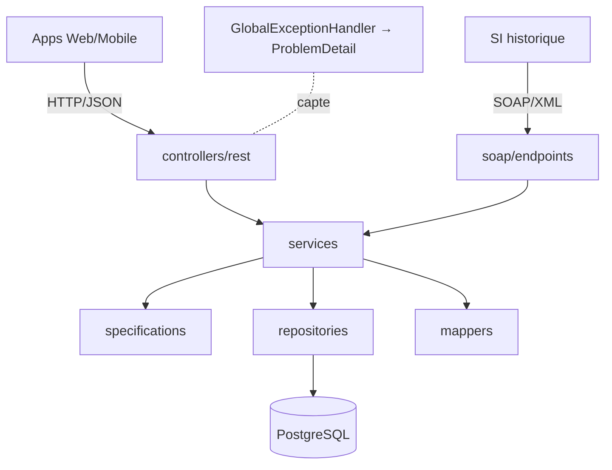
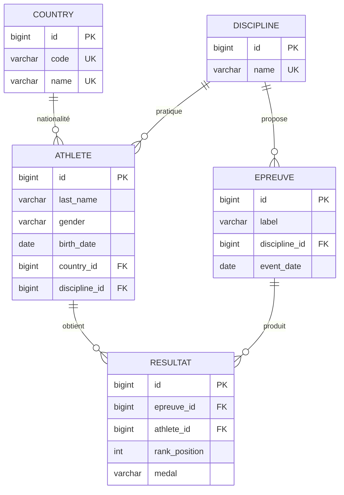
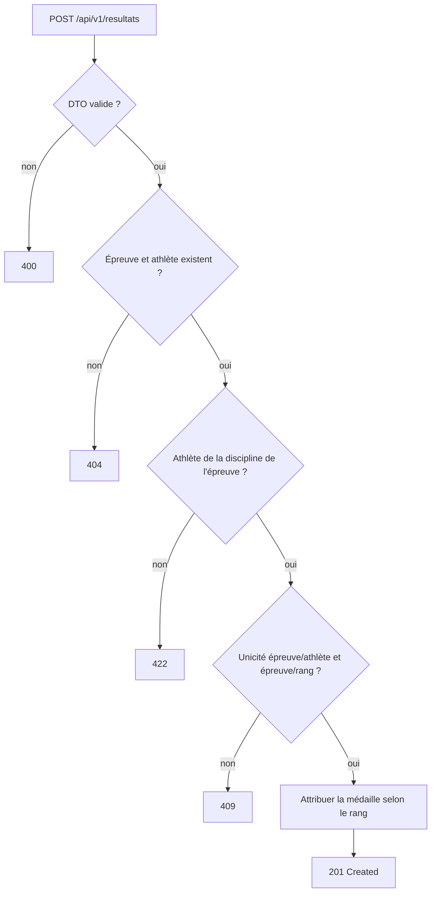

# Plateforme JO — API REST & Web Service SOAP

[](https://github.com/Habibou-BA/jodak/actions/workflows/ci.yml)
[](https://github.com/Habibou-BA/jodak/actions/workflows/codeql.yml)

Plateforme numérique centralisée des Jeux Olympiques : gestion des disciplines, athlètes, épreuves
et résultats, calcul automatique du tableau des médailles et statistiques. Elle expose
**simultanément** une **API REST** (applications Web/Mobile) et un **Web Service SOAP en lecture
seule** (système d'information historique), au-dessus d'un **socle de services unique**.

> Projet Java 21 / Spring Boot 3 conçu comme référence pédagogique et base de mise en production.

## Sommaire

- [Fonctionnalités](#fonctionnalités)
- [Architecture](#architecture)
- [Modèle de données](#modèle-de-données)
- [Flux métier — enregistrement d'un résultat](#flux-métier--enregistrement-dun-résultat)
- [Technologies](#technologies)
- [Prérequis](#prérequis)
- [Lancement](#lancement)
- [Configuration & profils](#configuration--profils)
- [Base de données, Flyway & jeu de démo](#base-de-données-flyway--jeu-de-démo)
- [API REST & Swagger](#api-rest--swagger)
- [Web Service SOAP](#web-service-soap)
- [Supervision](#supervision)
- [Tests](#tests)
- [Intégration continue (CI/CD)](#intégration-continue-cicd)
- [Commandes Maven](#commandes-maven)
- [Organisation des packages](#organisation-des-packages)
- [Collection Postman](#collection-postman)

## Fonctionnalités

| Domaine | Points d'entrée | Faits marquants |
|---|---|---|
| **Disciplines** | CRUD + `GET /disciplines/{id}/athletes` | Nom unique (insensible à la casse) |
| **Nations** | Création + consultation | Référentiel (code ISO), jeu de référence Flyway |
| **Athlètes** | CRUD (PUT + PATCH) + recherche multicritère | Specifications, pagination, tri |
| **Épreuves** | CRUD + recherche par discipline / par date | Unicité (libellé, discipline, date) |
| **Résultats** | CRUD + `GET /epreuves/{id}/podium` | Médaille auto (rang→médaille), cohérences 409/422 |
| **Tableau des médailles** | `GET /tableau-medailles` | Classement or→argent→bronze (départage A→Z) |
| **Tableau de bord** | `GET /tableau-de-bord` (+ `/classement-points`) | Compteurs + points (Or=7, Argent=4, Bronze=1) |
| **SOAP** | `GetAthlete`, `GetMedalTable` | Lecture seule (SI historique), contrat XSD/WSDL |

## Architecture

Architecture en couches ; REST et SOAP sont deux **façades minces** au-dessus des mêmes services.



## Modèle de données



La médaille est **dérivée du rang** (1→OR, 2→ARGENT, 3→BRONZE) et verrouillée en base par un
`CHECK`. Les contraintes (PK, FK, `CHECK`, `UNIQUE`, index) sont portées par les migrations Flyway.

## Flux métier — enregistrement d'un résultat



## Technologies

Java 21 · Spring Boot 3.5 · Maven · PostgreSQL 16 · Spring Data JPA · Spring Validation ·
Spring Web · Spring WS (SOAP) · SpringDoc OpenAPI/Swagger · Lombok · Flyway · Actuator ·
Docker / Docker Compose · JUnit 5 · Mockito · Testcontainers · JAXB.

**Interdits** : MapStruct, Gradle.

## Prérequis

- **JDK 21** (build/run local). Via SDKMAN : `sdk install java 21-tem` — sous Windows :
  `winget install EclipseAdoptium.Temurin.21.JDK`
- **Maven 3.9+**
- **Docker** et **Docker Compose**

> **Windows** : Docker Desktop avec le backend **WSL 2**, en mode **conteneurs Linux** (le mode
> conteneurs Windows ne sait pas construire cette image). Les commandes ci-dessous sont identiques
> dans PowerShell. Les ports **8080** et **5432** doivent être libres.

## Lancement

### Option A — Docker Compose (recommandé)

Démarre PostgreSQL **et** l'application (profil `prod`) :

```bash
docker compose up --build
```

- API : http://localhost:8080
- Swagger UI : http://localhost:8080/swagger-ui.html
- WSDL : http://localhost:8080/ws/olympics.wsdl
- Santé : http://localhost:8080/actuator/health

### Option B — Local (profil `dev`, avec jeu de démonstration)

```bash
docker compose up -d db      # PostgreSQL seul
mvn spring-boot:run          # application (profil dev par défaut)
```

Le profil `dev` charge un **jeu de démonstration** (disciplines, épreuves, athlètes, résultats),
de quoi obtenir immédiatement un tableau des médailles peuplé.

## Configuration & profils

| Profil | Datasource | Flyway | Usage |
|---|---|---|---|
| `dev` (défaut) | PostgreSQL local | `db/migration` + `db/seed` | Développement (données de démo) |
| `test` | Testcontainers | `db/migration` | Tests d'intégration |
| `prod` | Variables d'environnement | `db/migration` | Production / Docker |

L'application **ne requiert aucune authentification** et n'a besoin d'aucun secret. Les seules
variables utiles (facultatives) concernent la base de données ; elles sont documentées dans
[`.env.example`](.env.example) et lues par `docker-compose`.

| Variable | Rôle | Défaut |
|---|---|---|
| `POSTGRES_DB` / `POSTGRES_USER` / `POSTGRES_PASSWORD` | Base PostgreSQL (docker-compose) | `olympics` |
| `SPRING_DATASOURCE_URL` / `_USERNAME` / `_PASSWORD` | Connexion PostgreSQL (déploiement prod hors Docker) | — |

## Base de données, Flyway & jeu de démo

- Migrations **Flyway en SQL brut** (`src/main/resources/db/migration`) : `V1` disciplines →
  `V5` résultats. Contraintes portées par la base (PK, FK, UNIQUE, CHECK, INDEX).
- `hibernate.ddl-auto=validate` : Hibernate **valide** le schéma, ne le modifie jamais.
- **Jeu de démo** (`db/seed`, profil `dev` uniquement) : **callback Flyway `afterMigrate`**
  idempotent, réalignant les séquences d'identité après insertion. Étant un callback, il n'est
  **pas** enregistré dans l'historique Flyway — aucune contamination entre profils (le profil
  `prod` n'inclut pas `db/seed`).

## API REST & Swagger

- **API entièrement ouverte** : aucune authentification, tous les endpoints (lecture **et**
  écriture) sont appelables directement — aucun `401`/`403`.
- Préfixe : `/api/v1/`
- Erreurs uniformisées via **`ProblemDetail`** (RFC 7807), messages en français.
- Réponses de liste paginées homogènes (`content`, `page`, `size`, `totalElements`, …).
- Documentation interactive : **Swagger UI** (`/swagger-ui.html`) — testez toutes les opérations
  sans vous authentifier.

## Web Service SOAP

Service **lecture seule** pour le SI historique (Spring WS), contrat **XSD** →
classes JAXB générées au build.

- Endpoint : `POST /ws` — WSDL : `GET /ws/olympics.wsdl`
- Opérations : `GetAthleteRequest` (consultation d'un athlète), `GetMedalTableRequest`
  (tableau des médailles).

Exemple d'enveloppe :

```xml
<soapenv:Envelope xmlns:soapenv="http://schemas.xmlsoap.org/soap/envelope/"
                  xmlns:ol="http://jodak.com/olympics/soap">
  <soapenv:Body>
    <ol:GetAthleteRequest><ol:id>1</ol:id></ol:GetAthleteRequest>
  </soapenv:Body>
</soapenv:Envelope>
```

## Supervision

Spring Boot Actuator expose la santé : `GET /actuator/health` (utilisée par le healthcheck Docker).

- **Unitaires** (JUnit 5 + Mockito) — rapides, sans Docker : `mvn test`
- **Intégration** (`*IT`, Testcontainers PostgreSQL) — nécessitent Docker : `mvn verify`

`mvn verify` fonctionne avec **Java 21 et un démon Docker démarré**, sans réglage manuel : la
version d'API Docker (compatibilité Docker Engine ≥ 29) et la désactivation de Ryuk sont déjà
configurées dans le projet (`maven-failsafe-plugin` et `src/test/resources/testcontainers.properties`).

Si Testcontainers ne trouve pas le démon Docker (ex. socket Docker Desktop non standard), indiquez-le :

```bash
export DOCKER_HOST="unix://$HOME/Library/Containers/com.docker.docker/Data/docker.raw.sock"
mvn verify
```

## Intégration continue (CI/CD)

Trois workflows GitHub Actions (dossier [`.github`](.github)) :

| Workflow | Fichier | Déclencheurs | Rôle |
|---|---|---|---|
| **CI** | [`ci.yml`](.github/workflows/ci.yml) | push `main`/tags `v*`, PR vers `main`, manuel | `mvn clean verify` (JDK 21 Temurin, cache Maven, tests **Testcontainers**), publie les rapports de tests et le jar ; puis, hors PR, **construit et publie l'image Docker sur GHCR** |
| **CodeQL** | [`codeql.yml`](.github/workflows/codeql.yml) | push/PR `main`, hebdomadaire | Analyse statique de sécurité (SAST) du code Java |
| **Dependabot** | [`dependabot.yml`](.github/dependabot.yml) | hebdomadaire | Propose par PR les mises à jour Maven et des actions GitHub |

**Détails**
- Le runner `ubuntu-latest` fournit un démon Docker : les tests d'intégration Testcontainers
  s'exécutent sans réglage (Ryuk désactivé via `src/test/resources/testcontainers.properties`).
- L'image est publiée sur **GitHub Container Registry** : `ghcr.io/habibou-ba/olympics-platform`,
  taguée par branche, version sémantique (`v1.2.3`), SHA court, et `latest` sur `main`. La
  publication utilise le `GITHUB_TOKEN` (permission `packages: write`) — aucun secret à configurer.
- Récupérer l'image : `docker pull ghcr.io/habibou-ba/olympics-platform:latest`.

**Mise en route (dépôt public)**
1. Poussez le code : le workflow **CI** démarre automatiquement.
2. Le package GHCR est privé par défaut ; rendez-le public via *Packages → Package settings*
   si vous souhaitez un `docker pull` anonyme.

## Commandes Maven

```bash
mvn clean verify          # build + tests unitaires et d'intégration
mvn test                  # tests unitaires uniquement
mvn spring-boot:run       # démarrer (profil dev)
mvn clean package         # produire le jar (target/olympics-platform-0.1.0.jar)
```

## Organisation des packages (`com.jodak`)

```text
config · constants · controllers/rest · dtos · entities · enums · exceptions
mappers · repositories · services/{interfaces,implementations}
soap/{endpoints,mappers,generated} · specifications · utils · validators
```

## Collection Postman

`postman/JO-Platform.postman_collection.json` — collection **complète, documentée et exécutable de
bout en bout**, **sans aucune authentification**.

- Organisée par domaine : Disciplines, Nations, Athlètes, Épreuves, Résultats, Tableau des
  médailles, Tableau de bord, SOAP, puis un dossier **Nettoyage**.
- **Run collection** (Collection Runner) exécute les 40 requêtes dans l'ordre : chaque création
  mémorise l'`id` renvoyé dans une variable (`disciplineId`, `athleteId`, `epreuveId`…), réutilisée
  par les requêtes suivantes ; le dossier **Nettoyage** supprime tout à la fin. Le scénario est donc
  **rejouable** et ne produit **aucun 401/403**.
- Chaque requête est documentée et porte des **données prêtes à l'emploi** + des tests (assertions
  de statut). Seule variable à connaître : `baseUrl` (défaut `http://localhost:8080`).

Testé avec `newman run postman/JO-Platform.postman_collection.json` : **40/40** assertions au vert.
